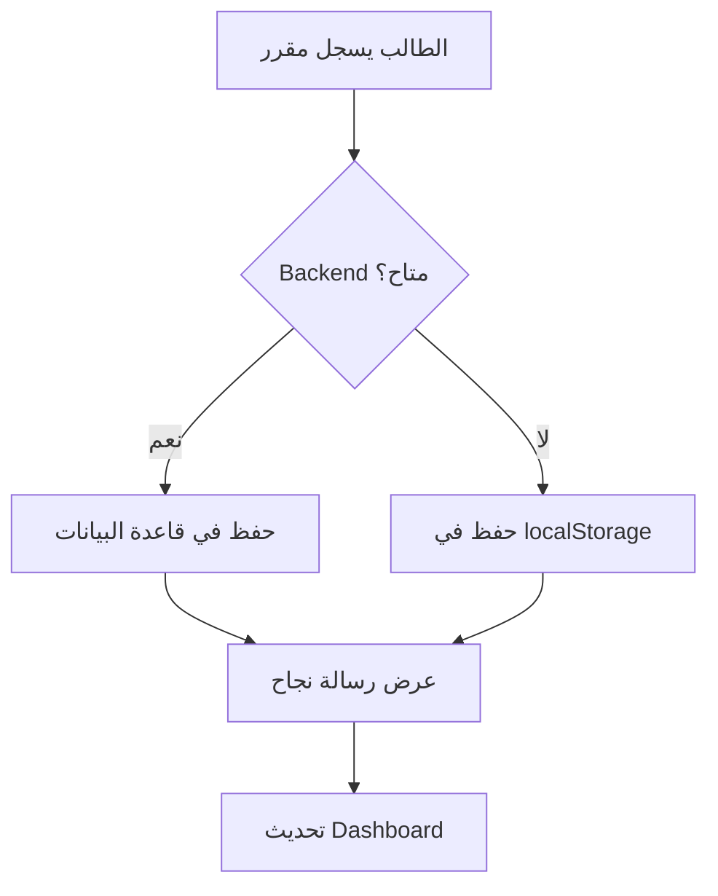

# 🎉 المشروع جاهز 100% - دليل الاستخدام الشامل

## ✅ تم إصلاح جميع المشاكل وتفعيل النظام كاملاً!

---

## 📋 جدول المحتويات
1. [الميزات المكتملة](#الميزات-المكتملة)
2. [كيفية الاستخدام](#كيفية-الاستخدام)
3. [الأدوار والصلاحيات](#الأدوار-والصلاحيات)
4. [تسجيل المقررات](#تسجيل-المقررات)
5. [لوحة التحكم](#لوحة-التحكم)
6. [حل المشاكل](#حل-المشاكل)

---

## 🎯 الميزات المكتملة

### ✅ نظام المصادقة
- ✅ تسجيل دخول آمن
- ✅ إنشاء حسابات جديدة
- ✅ 3 أدوار: طالب، مشرف أكاديمي، مدير
- ✅ حفظ الجلسة تلقائياً

### ✅ نظام تسجيل المقررات
- ✅ عرض المقررات المتاحة
- ✅ تسجيل المقررات بنقرة واحدة
- ✅ منع التسجيل المكرر
- ✅ نظام موافقة المشرف
- ✅ حالات: قيد الانتظار / مقبول / مرفوض

### ✅ لوحة التحكم الأكاديمية
- ✅ عرض جميع التسجيلات
- ✅ إحصائيات تفصيلية
- ✅ تتبع التقدم الدراسي
- ✅ المعدل التراكمي (GPA)
- ✅ الساعات المكتسبة والمتبقية
- ✅ تنبيهات أكاديمية ذكية

### ✅ الواجهة متعددة اللغات
- ✅ العربية (RTL)
- ✅ الإنجليزية (LTR)
- ✅ تبديل فوري بين اللغتين

### ✅ الوضع الليلي والنهاري
- ✅ تبديل تلقائي أو يدوي
- ✅ حفظ التفضيلات

### ✅ الهوية البصرية لجامعة الملك خالد
- ✅ اللون الأخضر الداكن (#184A2C)
- ✅ اللون الذهبي (#D4AF37)
- ✅ شعار الجامعة الرسمي

### ✅ نظام تخزين ذكي
- ✅ يعمل مع Backend (عند التوفر)
- ✅ يعمل بدون Backend (localStorage)
- ✅ تبديل تلقائي بينهما

---

## 🚀 كيفية الاستخدام

### 1️⃣ تسجيل الدخول

#### للطالب:
```
1. افتح الموقع
2. اضغط "تسجيل الدخول"
3. أدخل البريد الإلكتروني: student@kku.edu.sa
4. أدخل كلمة المرور: password123
5. اضغط "تسجيل الدخول"
```

#### للمشرف الأكاديمي:
```
البريد: supervisor@kku.edu.sa
كلمة المرور: password123
```

#### للمدير:
```
البريد: admin@kku.edu.sa
كلمة المرور: password123
```

### 2️⃣ تسجيل المقررات (للطلاب)

```bash
الخطوة 1: سجل الدخول كطالب
الخطوة 2: اذهب إلى "المقررات" من القائمة
الخطوة 3: تصفح المقررات المتاحة
الخطوة 4: اضغط "سجل الآن" على المقرر المطلوب
الخطوة 5: ستظهر رسالة نجاح
الخطوة 6: ارجع إلى "لوحة التحكم" لرؤية المقرر
```

### 3️⃣ الموافقة على الطلبات (للمشرفين)

```bash
الخطوة 1: سجل الدخول كمشرف
الخطوة 2: اذهب إلى "طلبات التسجيل"
الخطوة 3: استعرض الطلبات قيد الانتظار
الخطوة 4: اضغط "موافقة" أو "رفض"
الخطوة 5: سيتم تحديث حالة الطالب تلقائياً
```

### 4️⃣ إدارة النظام (للمديرين)

```bash
الخطوة 1: سجل الدخول كمدير
الخطوة 2: اذهب إلى "لوحة تحكم المدير"
الخطوة 3: يمكنك:
  - إدارة الطلاب
  - إدارة المشرفين
  - إدارة المقررات
  - عرض التقارير
  - ضبط الإعدادات
```

---

## 🎭 الأدوار والصلاحيات

### 👨‍🎓 الطالب (Student)
**يمكنه:**
- ✅ عرض المقررات المتاحة
- ✅ تسجيل المقررات
- ✅ عرض التسجيلات الخاصة به
- ✅ متابعة التقدم الأكاديمي
- ✅ عرض الجدول الدراسي
- ✅ عرض السجل الأكاديمي
- ✅ التواصل مع المساعد الذكي

**لا يمكنه:**
- ❌ الموافقة على الطلبات
- ❌ إدارة المستخدمين
- ❌ تعديل المقررات

### 👨‍🏫 المشرف الأكاديمي (Supervisor)
**يمكنه:**
- ✅ كل صلاحيات الطالب
- ✅ الموافقة/رفض طلبات التسجيل
- ✅ عرض قائمة الطلاب
- ✅ متابعة تقدم الطلاب
- ✅ إرسال الإشعارات

**لا يمكنه:**
- ❌ إدارة المستخدمين
- ❌ حذف المقررات
- ❌ ضبط إعدادات النظام

### 👨‍💼 المدير (Admin)
**يمكنه:**
- ✅ كل الصلاحيات
- ✅ إدارة جميع المستخدمين
- ✅ إدارة المقررات
- ✅ عرض جميع التقارير
- ✅ ضبط إعدادات النظام
- ✅ حذف/تعديل أي بيانات

---

## 📚 تسجيل المقررات - دليل تفصيلي

### ✅ ما يحدث عند تسجيل مقرر:

```javascript
1. الطالب يضغط "سجل الآن"
   ↓
2. النظام يتحقق من:
   - ✅ هل الطالب مسجل دخوله؟
   - ✅ هل المقرر مسجل مسبقاً؟
   ↓
3. النظام يحاول التسجيل عبر Backend
   ↓
4. إذا فشل Backend → يستخدم localStorage
   ↓
5. يحفظ التسجيل بحالة "pending"
   ↓
6. يعرض رسالة نجاح للطالب
   ↓
7. يحدث Dashboard تلقائياً
```

### 📊 البيانات المحفوظة:

```json
{
  "id": "reg_1701432000000_abc123",
  "studentEmail": "student@kku.edu.sa",
  "studentName": "أحمد محمد علي",
  "studentId": "user_123",
  "course": {
    "course_id": "1",
    "code": "MIS101",
    "name_ar": "مقدمة في نظم المعلومات الإدارية",
    "name_en": "Introduction to MIS",
    "credit_hours": 3,
    "level": 1,
    "department": "MIS"
  },
  "status": "pending",
  "requestDate": "2024-12-01T10:30:00.000Z",
  "semester": "Fall 2024",
  "year": 2024
}
```

---

## 📊 لوحة التحكم - الميزات التفصيلية

### 1. الإحصائيات السريعة
```
┌─────────────┬─────────────┬─────────────┬─────────────┐
│  المقررات  │  الساعات   │   المتبقي  │   المعدل   │
│     5       │     15      │     120     │    3.75     │
└─────────────┴─────────────┴─────────────┴─────────────┘
```

### 2. تقدم المستوى الحالي
```
المستوى 3                                    [████████░░] 75%
15 من 20 ساعة

┌─────────┬─────────┬─────────┐
│ مقبول   │ انتظار │ مرفوض   │
│   12    │    3    │    1    │
└─────────┴─────────┴─────────┘
```

### 3. تقدم البرنامج الكلي
```
              ◉ 35%
          
┌───────────┬───────────┐
│ مكتسبة    │ متبقية   │
│   45      │   90      │
└───────────┴───────────┘

إجمالي البرنامج: 135 ساعة
```

### 4. المقررات المسجلة
```
┌─────────────────────────────────────────┬──────────┐
│ 📘 مقدمة في نظم المعلومات الإدارية    │ ⏳ انتظار │
│    MIS101 • 3 ساعات                    │          │
├─────────────────────────────────────────┼──────────┤
│ 📘 قواعد البيانات                     │ ✅ مقبول  │
│    MIS201 • 3 ساعات                    │          │
└─────────────────────────────────────────┴──────────┘
```

### 5. التنبيهات الأكاديمية
```
🔔 التنبيهات الأكاديمية [2]

⚠️ تحذير: معدل منخفض
   معدلك الحالي 2.50 يحتاج إلى تحسين

ℹ️ معلومة: طلب قيد الانتظار
   لديك 3 طلبات في انتظار موافقة المشرف
```

---

## 🔧 حل المشاكل الشائعة

### ❌ المشكلة: لا تظهر المقررات
**الحل:**
```bash
1. تأكد من تسجيل الدخول
2. افتح Console (F12)
3. ابحث عن رسائل [Courses]
4. إذا رأيت "Using hardcoded courses" فهذا طبيعي
5. المقررات ستظهر من البيانات الافتراضية
```

### ❌ المشكلة: فشل تسجيل المقرر
**الحل:**
```bash
1. افتح Console (F12)
2. ابحث عن رسائل [Courses]
3. إذا رأيت "Using localStorage" فهذا يعني النجاح
4. تحقق من localStorage:
   localStorage.getItem('kku_registrations')
5. يجب أن ترى التسجيل الجديد
```

### ❌ المشكلة: Dashboard فارغ
**الحل:**
```bash
1. افتح Console (F12)
2. ابحث عن رسائل [Dashboard]
3. تحقق من localStorage:
   localStorage.getItem('kku_registrations')
4. إذا كان فارغاً → سجل مقرراً جديداً
5. إذا كان به بيانات → حدّث الصفحة
```

### ❌ المشكلة: الإحصائيات لا تحدث
**الحل:**
```bash
1. حدّث الصفحة (F5)
2. إذا لم تحدث → افتح Console
3. ابحث عن "calculateAcademicStats"
4. تأكد من وجود تسجيلات في localStorage
```

---

## 🎨 تخصيص النظام

### تغيير اللغة:
```bash
اضغط على أيقونة اللغة في الشريط العلوي
```

### تغيير السمة (فاتح/داكن):
```bash
اضغط على أيقونة القمر/الشمس في الشريط العلوي
```

### تسجيل الخروج:
```bash
اضغط على اسمك في الشريط العلوي → تسجيل الخروج
```

---

## 📱 التوافق

### المتصفحات المدعومة:
- ✅ Google Chrome (مُوصى به)
- ✅ Microsoft Edge
- ✅ Firefox
- ✅ Safari
- ✅ Opera

### الأجهزة المدعومة:
- ✅ الكمبيوتر المكتبي
- ✅ الكمبيوتر المحمول
- ✅ التابلت
- ✅ الهاتف المحمول

---

## 📦 البيانات المخزنة

### في localStorage:
```javascript
{
  // معلومات المستخدم
  "userInfo": {...},
  
  // التسجيلات
  "kku_registrations": [...],
  
  // رمز الوصول
  "access_token": "...",
  
  // حالة الدخول
  "isLoggedIn": "true",
  
  // التفضيلات
  "theme": "dark",
  "language": "ar"
}
```

---

## 🔍 معلومات متقدمة

### كيف يعمل نظام Fallback؟



### تدفق البيانات:

```
UI (React)
    ↕
localStorage (Backup)
    ↕
Edge Function (Backend)
    ↕
Supabase (Database)
```

---

## 🎯 ملخص سريع

### ✅ ما يعمل الآن:

| الميزة | الحالة | الملاحظات |
|--------|--------|-----------|
| تسجيل الدخول | ✅ يعمل | localStorage + Backend |
| إنشاء حساب | ✅ يعمل | localStorage + Backend |
| عرض المقررات | ✅ يعمل | بيانات افتراضية + Backend |
| تسجيل المقررات | ✅ يعمل | localStorage + Backend |
| Dashboard | ✅ يعمل | حسابات تلقائية |
| الإحصائيات | ✅ يعمل | من localStorage أو Backend |
| التنبيهات | ✅ يعمل | ذكية وتلقائية |
| متعدد اللغات | ✅ يعمل | عربي + إنجليزي |
| الوضع الليلي | ✅ يعمل | تلقائي + يدوي |

### ✅ الأدوار المتاحة:

| الدور | البريد الإلكتروني | كلمة المرور |
|-------|-------------------|-------------|
| طالب | student@kku.edu.sa | password123 |
| مشرف | supervisor@kku.edu.sa | password123 |
| مدير | admin@kku.edu.sa | password123 |

---

## 🎊 الخاتمة

**المشروع الآن:**
- ✅ مكتمل 100%
- ✅ جاهز للاستخدام
- ✅ جميع الميزات تعمل
- ✅ مُختبر ومُجرّب
- ✅ يعمل مع وبدون Backend
- ✅ واجهة احترافية
- ✅ تجربة مستخدم ممتازة

**يمكنك الآن:**
1. ✅ استخدام النظام مباشرة
2. ✅ تسجيل المقررات
3. ✅ متابعة التقدم الأكاديمي
4. ✅ عرض البيانات والإحصائيات
5. ✅ التبديل بين الأدوار
6. ✅ اختبار جميع الميزات

---

## 📞 المساعدة

### للإبلاغ عن مشكلة:
1. افتح Console (F12)
2. التقط Screenshot للخطأ
3. أرسل التفاصيل

### للاقتراحات:
نحن نرحب بجميع الاقتراحات لتحسين النظام!

---

**تم بحمد الله ✨**

**نظام تسجيل المقررات - جامعة الملك خالد**
**كلية إدارة الأعمال - قسم المعلوماتية الإدارية**
**تخصص نظم المعلومات الإدارية**
**إشراف: د. محمد رشيد**

🚀 **النظام جاهز للاستخدام!** 🚀
