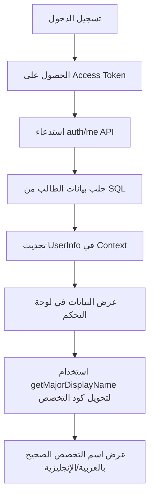

# ✅ الخطوة 2: تحديث لوحة تحكم الطالب - مكتملة

## ما تم إنجازه:

### ✅ تم بنجاح:

1. **إضافة استيراد من ملف التخصصات**:
   ```typescript
   import { MAJORS, getMajorByCode } from '../../utils/departments';
   ```

2. **إضافة دالة `getMajorDisplayName`** لتحويل كود التخصص إلى اسمه بالعربية أو الإنجليزية:
   ```typescript
   const getMajorDisplayName = (majorCode: string): string => {
     const major = getMajorByCode(majorCode);
     if (major) {
       return language === 'ar' ? major.name_ar : major.name_en;
     }
     // fallback للتخصصات الشائعة
     return majorCode;
   };
   ```

3. **تحديث عرض التخصص في Hero Section**:
   - بدلاً من عرض الكود الإنجليزي فقط (`Management Information Systems`)
   - الآن يعرض الاسم بالعربية أو الإنجليزية حسب اللغة المختارة
   - يستخدم الدالة `getMajorDisplayName(studentMajor)`

4. **عرض البيانات الصحيحة من قاعدة البيانات**:
   - ✅ المستوى (Level) من SQL
   - ✅ التخصص (Major) من SQL مع التحويل للاسم الصحيح
   - ✅ المعدل (GPA) من SQL
   - ✅ عدد الساعات والمقررات من SQL

5. **Debug Panel** يعرض البيانات الحقيقية من SQL:
   - الاسم
   - المستوى
   - التخصص (بالكود الأصلي)
   - المعدل

---

## 🎯 الميزات الجديدة:

### 1. عرض التخصص بشكل صحيح:
**قبل**: `Management Information Systems` (باللغة الإنجليزية فقط)

**بعد**: 
- **بالعربية**: `نظم المعلومات الإدارية`
- **بالإنجليزية**: `MIS`

### 2. دعم جميع التخصصات الـ 22:
الآن لوحة التحكم تدعم عرض أي من الـ 22 تخصصاً بشكل صحيح بكلا اللغتين:
- نظم المعلومات الإدارية - MIS
- نظم المعلومات - علم البيانات - MIS Data Science
- نظم المعلومات - الأمن السيبراني - MIS Cybersecurity
- إدارة الأعمال - Business Administration
- إدارة الأعمال - ريادة الأعمال - Entrepreneurship
- وجميع التخصصات الأخرى...

### 3. عرض البيانات الحقيقية من SQL:
- يتم جلب البيانات من `auth/me` endpoint
- يتم تحديث `userInfo` في Context
- يتم حفظ البيانات في `localStorage`
- يتم عرض البيانات في لوحة التحكم

---

## 📊 كيف يعمل النظام الآن؟



---

## 🧪 اختبار النظام:

لاختبار الخطوة 2، قم بالتالي:

1. **سجّل طالباً جديداً** من صفحة التسجيل
2. **اختر أي تخصص من القائمة** (22 خياراً)
3. **سجّل دخول الطالب**
4. **تحقق من لوحة التحكم**:
   - ✅ يجب أن يعرض التخصص الصحيح بالعربية أو الإنجليزية
   - ✅ يجب أن يعرض المستوى الصحيح
   - ✅ يجب أن يعرض المعدل الصحيح

---

## 🔧 الملفات المحدثة:

1. ✅ `/components/pages/StudentDashboard.tsx`
   - إضافة استيراد `getMajorByCode`
   - إضافة دالة `getMajorDisplayName`
   - تحديث عرض التخصص في Hero Section

---

## 🎯 الخطوة التالية:

**الخطوة 3**: إضافة نظام الإشعارات الحقيقي

- سنضيف مكون إشعارات حقيقي
- سيتم تخزين الإشعارات في قاعدة البيانات
- سيتم عرض الإشعارات في الوقت الفعلي
- سيتم إرسال إشعارات عند:
  - قبول/رفض طلب تسجيل مقرر
  - إضافة مقرر جديد
  - تحديث المعدل
  - رسائل من المشرف الأكاديمي

**تاريخ الإكمال**: 27 نوفمبر 2025
