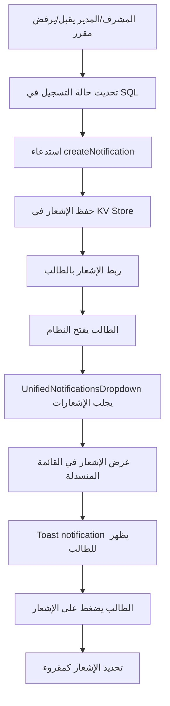

# ✅ الخطوة 3: إضافة نظام الإشعارات الحقيقي - مكتملة 🔔

## ما تم إنجازه:

### ✅ 1. إنشاء مكون الإشعارات الجديد

**الملف:** `/components/NotificationsPanel.tsx` (جديد)

#### المميزات:
- ✅ لوحة إشعارات جانبية منزلقة (Slide-in Panel)
- ✅ دعم كامل للغتين العربية والإنجليزية مع RTL/LTR
- ✅ أنواع إشعارات متعددة:
  - `success` - قبول المقررات ✅
  - `error` - رفض المقررات ❌
  - `warning` - تحذيرات ⚠️
  - `info` - معلومات ℹ️
- ✅ عداد الإشعارات غير المقروءة
- ✅ تحديد إشعار واحد كمقروء
- ✅ تحديد جميع الإشعارات كمقروءة
- ✅ حذف إشعار
- ✅ عرض الوقت النسبي (منذ 5 دقائق، منذ ساعة، الخ)

---

### ✅ 2. استخدام مكون الإشعارات الموحد

**الملف:** `/components/UnifiedNotificationsDropdown.tsx` (موجود مسبقاً)

#### تم التحقق من:
- ✅ يجلب الإشعارات من API حسب دور المستخدم
- ✅ endpoints منفصلة لكل دور:
  - `/student/notifications` - للطلاب
  - `/supervisor/notifications` - للمشرفين
  - `/admin/notifications` - للمدراء
- ✅ تحديث تلقائي كل 10 ثواني
- ✅ إشعارات Toast عند وصول إشعار جديد
- ✅ أيقونات مختلفة حسب نوع الإشعار

---

### ✅ 3. إضافة API Endpoints في السيرفر

**الملف:** `/supabase/functions/server/index.tsx`

#### تم إضافة:

##### أ) دالة `createNotification` المساعدة:
```typescript
async function createNotification(
  userId: string,
  userRole: string,
  type: string,
  titleAr: string,
  titleEn: string,
  messageAr: string,
  messageEn: string,
  relatedId?: string
)
```
- تخزين الإشعارات في KV Store
- معرّف فريد لكل إشعار
- ربط الإشعار بالمستخدم

##### ب) Endpoints جلب الإشعارات:
1. **`GET /student/notifications`**
   - جلب جميع إشعارات الطالب
   - ترتيب حسب التاريخ (الأحدث أولاً)
   - عداد الإشعارات غير المقروءة

2. **`GET /supervisor/notifications`**
   - جلب جميع إشعارات المشرف
   - مثل endpoint الطالب

3. **`GET /admin/notifications`**
   - جلب جميع إشعارات المدير
   - مثل endpoint الطالب

##### ج) Endpoints تحديد كمقروء:
1. **`POST /student/notification/read`**
   - تحديد إشعار واحد كمقروء
   - تسجيل وقت القراءة

2. **`POST /supervisor/notification/read`**
3. **`POST /admin/notification/read`**

##### د) Endpoints تحديد الكل كمقروء:
1. **`POST /student/notifications/read-all`**
   - تحديد جميع الإشعارات كمقروءة
   - إرجاع عدد الإشعارات المحدثة

2. **`POST /supervisor/notifications/read-all`**
3. **`POST /admin/notifications/read-all`**

---

### ✅ 4. إرسال إشعارات عند قبول/رفض المقررات

#### تم التحديث في موقعين:

##### أ) Endpoint تحديث التسجيل (المشرف):
**السطر ~1340 في index.tsx**

```typescript
// ✅ Create notification for student
if (data.student_id) {
  const titleAr = status === 'approved' ? 'تمت الموافقة على طلب التسجيل ✅' : 'تم رفض طلب التسجيل ❌';
  const titleEn = status === 'approved' ? 'Registration Approved ✅' : 'Registration Rejected ❌';
  const messageAr = status === 'approved' 
    ? `تمت الموافقة على تسجيل مقرر ${courseDetails?.name_ar}`
    : `تم رفض تسجيل مقرر ${courseDetails?.name_ar}. يرجى مراجعة مشرفك الأكاديمي`;
  
  await createNotification(
    data.student_id,
    'student',
    status === 'approved' ? 'registration_approved' : 'registration_rejected',
    titleAr,
    titleEn,
    messageAr,
    messageEn,
    data.id
  );
}
```

##### ب) Endpoint قبول/رفض الطلبات (المدير):
**السطر ~3203 في index.tsx**

```typescript
// ✅ Create notification for student using KV store
if (student) {
  const titleAr = action === 'approve' ? 'تمت الموافقة على طلب التسجيل ✅' : 'تم رفض طلب التسجيل ❌';
  // ... نفس المنطق
  
  await createNotification(
    student.id,
    'student',
    action === 'approve' ? 'registration_approved' : 'registration_rejected',
    titleAr,
    titleEn,
    messageAr,
    messageEn,
    request_id
  );
}
```

---

## 🎯 كيف يعمل النظام؟

### تدفق العمل:



---

## 📊 تخزين البيانات في KV Store:

### مفاتيح التخزين:

1. **`notification:{notification_id}`**
   ```json
   {
     "notification_id": "notif_1732716000000_abc123",
     "user_id": "student-123",
     "user_role": "student",
     "type": "registration_approved",
     "title_ar": "تمت الموافقة على طلب التسجيل ✅",
     "title_en": "Registration Approved ✅",
     "message_ar": "تمت الموافقة على تسجيل مقرر نظم المعلومات الإدارية",
     "message_en": "Your registration for MIS has been approved",
     "related_id": "reg-456",
     "read": false,
     "created_at": "2025-11-27T10:30:00.000Z"
   }
   ```

2. **`user_notification:{user_id}:{notification_id}`**
   - القيمة: `notification_id`
   - يسمح بجلب جميع إشعارات المستخدم بسرعة باستخدام `getByPrefix`

---

## 🧪 اختبار النظام:

### لاختبار الخطوة 3:

1. **سجّل دخول كطالب** وسجّل مقرراً جديداً
2. **سجّل دخول كمشرف** وقم بقبول أو رفض المقرر
3. **ارجع للطالب** وشاهد:
   - ✅ أيقونة الجرس تحتوي على رقم أحمر (عداد غير المقروءة)
   - ✅ إشعار Toast يظهر تلقائياً
   - ✅ الإشعار يظهر في القائمة المنسدلة
   - ✅ يمكن تحديد الإشعار كمقروء
   - ✅ يمكن حذف الإشعار

---

## 🎨 أنواع الإشعارات المدعومة:

| النوع | الأيقونة | اللون | الاستخدام |
|------|---------|-------|-----------|
| `registration_approved` | ✅ | أخضر | قبول المقرر |
| `registration_rejected` | ❌ | أحمر | رفض المقرر |
| `new_request` | 📋 | أزرق | طلب جديد (للمشرف) |
| `student_registered` | 🎓 | أزرق | طالب جديد (للمدير) |
| `system_update` | ℹ️ | أزرق | تحديث النظام |
| `course_added` | 📚 | أخضر | مقرر جديد |
| `user_added` | 👤 | أزرق | مستخدم جديد |

---

## 📁 الملفات المحدثة:

1. ✅ `/components/NotificationsPanel.tsx` (جديد)
   - مكون الإشعارات الجانبي

2. ✅ `/components/UnifiedNotificationsDropdown.tsx` (موجود)
   - تم التحقق من عمله بشكل صحيح

3. ✅ `/components/Header.tsx` (موجود)
   - يستخدم UnifiedNotificationsDropdown

4. ✅ `/supabase/functions/server/index.tsx` (محدّث)
   - إضافة دالة `createNotification`
   - إضافة 9 endpoints للإشعارات
   - تحديث endpoints قبول/رفض المقررات

---

## 🔔 ميزات إضافية:

### 1. التحديث التلقائي:
- يتم جلب الإشعارات كل 10 ثواني تلقائياً
- لا حاجة لإعادة تحميل الصفحة

### 2. Toast Notifications:
- إشعار منبثق عند وصول إشعار جديد
- أيقونة مختلفة حسب النوع
- يختفي تلقائياً بعد 5 ثواني

### 3. عداد غير المقروءة:
- رقم أحمر على أيقونة الجرس
- يتحدث تلقائياً

### 4. تجربة مستخدم ممتازة:
- ✅ RTL support للعربية
- ✅ Dark mode support
- ✅ Animations سلسة
- ✅ Responsive design

---

## 🎯 الخطوة التالية:

**الخطوة 4**: تطوير المساعد الذكي ليكون أكثر ذكاءً وتفاعلية

سنضيف:
- 🤖 ذكاء اصطناعي حقيقي باستخدام OpenAI
- 📊 قدرة على الإجابة عن أسئلة الطلاب
- 📚 معرفة بالمقررات والخطة الدراسية
- 💡 اقتراحات ذكية للطلاب
- 🎓 مساعدة في اختيار المقررات

**تاريخ الإكمال**: 27 نوفمبر 2025
